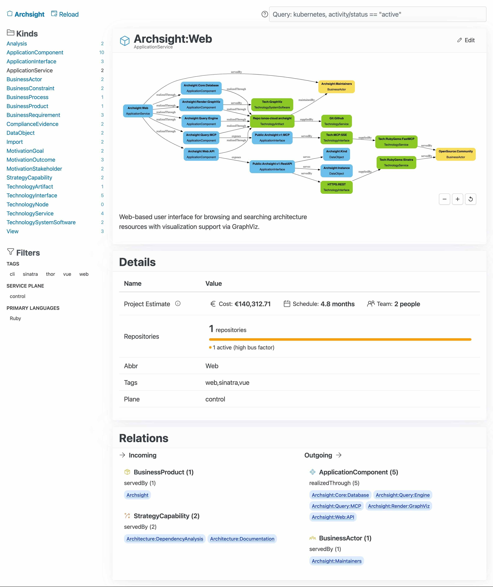
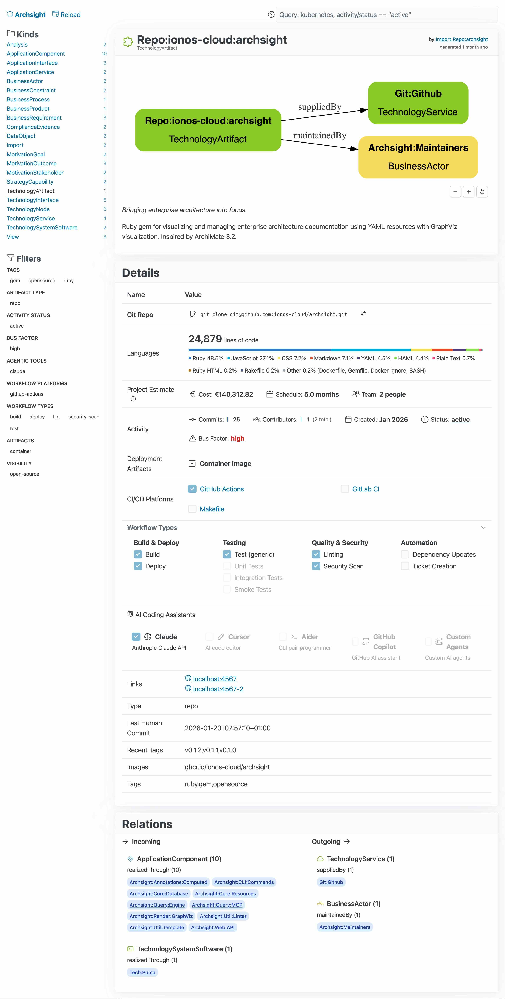

# Archsight

[](https://github.com/ionos-cloud/archsight/actions/workflows/ci.yml)
[](https://badge.fury.io/rb/archsight)

*Bringing enterprise architecture into focus.*

Ruby gem for visualizing and managing enterprise architecture documentation using YAML resources with GraphViz visualization. Inspired by ArchiMate 3.2.

| Service view | Artifact view |
|:---:|:---:|
|  |  |

## Installation

Add to your Gemfile:

```ruby
gem 'archsight'
```

Or install directly:

```bash
gem install archsight
```

## Quick Start

```bash
# Start web server (looks for resources in current directory)
archsight web

# Start with custom resources path
archsight web --resources /path/to/resources

# Or use environment variable
ARCHSIGHT_RESOURCES_DIR=/path/to/resources archsight web
```

Access at: <http://localhost:4567>

Also available as [Docker](docs/docker.md) image and [Helm chart](docs/kubernetes.md).

## CLI Commands

```bash
archsight web [OPTIONS]      # Start web server
archsight lint               # Validate YAML and relations
archsight import             # Execute pending imports
archsight analyze            # Execute analysis scripts
archsight template KIND      # Generate YAML template for a resource type
archsight console            # Interactive Ruby console
archsight version            # Show version
```

### Web Server Options

```bash
archsight web [--resources PATH] [--port PORT] [--host HOST]
              [--production] [--disable-reload] [--enable-logging]
```

| Option | Description |
|--------|-------------|
| `-r, --resources PATH` | Path to resources directory |
| `-p, --port PORT` | Port to listen on (default: 4567) |
| `-H, --host HOST` | Host to bind to (default: localhost) |
| `--production` | Run in production mode (quiet startup) |
| `--disable-reload` | Disable the reload button in the UI |
| `--enable-logging` | Enable request logging (default: false in dev, true in prod) |

## Features

### MCP Server

The tool includes an MCP (Model Context Protocol) server that enables AI assistants to query and analyze the architecture data programmatically.

**Start the server:**

```bash
archsight web
```

**Add to Claude Code:**

```bash
claude mcp add --transport sse ionos-architecture http://localhost:4567/mcp/sse
```

**Available tools:**

- `query` - Search and filter resources using the query language
- `analyze_resource` - Get detailed resource information and impact analysis
- `resource_doc` - Get documentation for resource kinds

### Web Interface

**Browse & Search:**

- Browse resources by type (Products, Services, Components, Requirements, etc.)
- Search by name or tag using the [query language](docs/search.md)
- Filter by annotations (quality attributes, status, frameworks)

**Visualization:**

- Interactive GraphViz diagrams showing relationships
- Zoom/pan controls for large diagrams
- Dark mode support
- Layer-based color scheme (Business, Application, Technology, Data)

### Resource Editor

Create and edit resources through the web interface:

**Edit existing resource:**

- Navigate to any resource detail page
- Click the "Edit" button (only available for non-generated resources)
- Modify annotations and relations
- Generate YAML and copy to clipboard

**Create new resource:**

- Go to any kind listing (e.g., /kinds/ApplicationComponent)
- Click "New" button
- Fill in required fields
- Add relations using cascading dropdowns
- Generate YAML and copy to clipboard

The editor supports:

- Type-aware form fields (dropdowns for enums, number inputs, URL validation)
- Markdown textarea for descriptions
- Relation management with cascading dropdowns
- Validation before YAML generation
- One-click copy to clipboard

### Validation

Validate YAML syntax and verify all relationship references:

```bash
archsight lint
```

**Checks:**

- YAML syntax correctness
- Resource kind definitions exist
- All relation references point to existing resources
- Prevents broken links between resources

## Documentation

Detailed documentation is available in the web interface under the Help menu:

| Guide | Description |
|-------|-------------|
| [Modeling Guide](docs/modeling.md) | How to model architecture using resource types and relations |
| [Query Language](docs/search.md) | Full query syntax reference for searching resources |
| [Computed Annotations](docs/computed_annotations.md) | Aggregating values across relations |
| [ArchiMate Reference](docs/archimate.md) | ArchiMate concepts and mapping |
| [TOGAF Reference](docs/togaf.md) | TOGAF alignment and concepts |
| [Architecture](docs/architecture.md) | Technology stack and directory structure |
| [Docker](docs/docker.md) | Running Archsight in Docker |
| [Kubernetes](docs/kubernetes.md) | Helm chart deployment guide |

## Architecture

See [Architecture](docs/architecture.md) for the technology stack and directory structure.

## Contributing

See [CONTRIBUTING.md](CONTRIBUTING.md) for development setup, code style guidelines, and pull request process.

## License

Apache 2.0 License. See LICENSE.txt for details.
