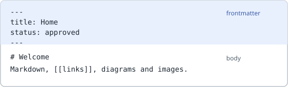

# Writing Pages

Pages are how a team documents *why* next to the model that says *what*. Reference: [Wiki Pages](/doc/pages).

## Create a page

1. Add `my-topic.md` anywhere below the resources directory with a frontmatter block.
2. List its name (file name without `.md`) under `spec.contains.pages` of a `PageMenu`.
3. Reload. `archsight lint` reports pages that no menu contains.

```markdown
---
title: My Topic
tags: concept
owner: Jane Doe <jane.doe@example.com>
status: rfc
toc: yes
---

# My Topic
```

Markdown without frontmatter is ignored, so READMEs next to your resources stay untouched.

## Link to the model

| Write | Result |
|-------|--------|
| `[[Home]]` | Link to a page by title or name |
| `[[ApplicationComponent/Archsight:Web:API]]` | Link to a resource |

Append `|` and a text inside the brackets to change the link text. Prefer links over pasted facts. A description copied into a page is out of date the day after.

## Images and diagrams

Images and draw.io diagrams are plain files in the resources directory, usually next to the page that shows them. A page refers to them with a relative path:



```markdown


```

Both files sit in the same folder as this page (`pages/`). `..` works too (`../diagrams/overview.drawio`), but a path can never leave the resources directory. Files of type png, jpg, gif, webp, avif, svg and drawio are served, through `/api/v1/assets/`, and `archsight lint` reports references that do not resolve.

## Lifecycle with `status`

`status` is free text, this handbook uses `rfc` (open for comments), `wip` and `approved`. Filter with
`Page: page/status == "rfc"` to see what needs a review.

## Migrating from Confluence

Add `links: { confluence: <URL of the old page> }` to the frontmatter. The page shows a link to it, so readers can
compare while you migrate. Draw.io drawings become [[Diagrams in Pages]].
